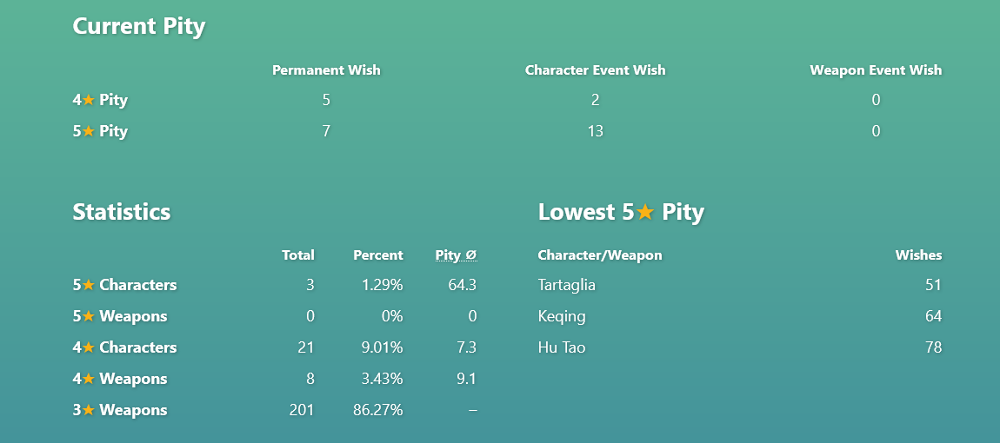
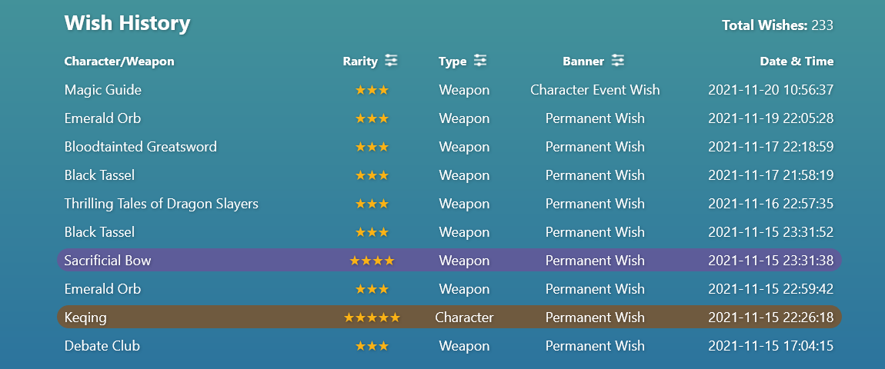

# Wishing Well

Wishing Well is a lightweight tool that backs up and analyzes your Genshin Impact wish history.

### Runs on your PC

Unlike other tools with a similar function, Wishing Well runs on your own PC. No data ever leaves your computer.

### Feature overview

- Save your wish history locally
- View your pity for all banners
- Browse your wish history quickly, including some simple filters
- Check out some nifty statistics about your wish history
- Support for multiple accounts/UIDs

## Frequently asked questions

### How do I use this?

Just download the installer (or the installer-less archive, if you prefer), run it and enter your feedback or event URL (instructions inside). That's it!

### Why does it open a website? How does that work?

Wishing Well will open in your browser, simply because it's a lot easier (and prettier!) to present the data like that. Here's how that works: when you start Wishing Well, it will run a local web server (only accessible from your own PC) and automatically point your browser to it. The web server will keep running as long as you have at least one tab of Wishing Well open. When you close all the tabs, the web server Wishing Well has started will shut down soon after.

### Can I bookmark the page Wishing Well opens in my browser?

No, that will not work. The web server that Wishing Well starts whenever you run it will stop running after all tabs have been closed. It's not always running in the background. So when you want to open Wishing Well, you'll always have to do so by running the program.

### How do I use Wishing Well for multiple accounts?

Just use Wishing Well like you normally would, but using the feedback or event URL for your other accounts as well. The wish history data includes your UID, and Wishing Well will automatically store the wish history for multiple accounts separately. When it has saved data for multiple UIDs, it will allow you to select the UID you want to view the statistics and wish history for.

### How does Wishing Well get my wish history?

The same way the game does! It just automates it all and then stores the history locally. That way, you can browse it much faster.

### Why make another one of these?

I wanted to create a tool for the backup and analyzation of your wish history that is not a website, but runs locally instead. That way, you don't need to share your authentication token with any third parties, and you have complete control over any data that is being generated and stored. Also, it was a lot of fun to make :)

### Where are my wishes stored?

On your computer! If you're on Windows, your wish history is stored in `%APPDATA\wishing-well`, while on Linux or macOS, the history will be stored in `~/.config/wishing-well`.

### Can I use this with a Chinese account?

Chinese accounts are currently not supported. If there's enough interest for this, I will add support for Chinese accounts as well.

### Are platforms besides Windows supported?

Wishing Well is written in Python and should be able to run on all major desktop operating systems. If you're on Linux or macOS, all you need is Python (at least version 3.9). Just check out the repository and run `python3 wishing-well.py`. (Note: Tkinter is required for some error messages. Some Linux distributions do not bundle Tkinter with the rest of Python's standard library. For example, on Debian, the required package is called `python3-tk`.)

## Thank you

- [genshin.py](https://github.com/thesadru/genshin.py) - For some details of the wish history endpoints

## Wishing Well uses

- [Alpine.js](https://github.com/alpinejs/alpine) - [License](3rd-party-licenses/LICENSE_alpinejs)
- [bottle.py](https://github.com/bottlepy/bottle) - [License](3rd-party-licenses/LICENSE_bottlepy)
- [Nuitka](https://github.com/Nuitka/Nuitka) - [License](3rd-party-licenses/LICENSE_Nuitka)

---
Wishing Well is not affiliated with miHoYo. Genshin Impact is a trademark of miHoYo.
